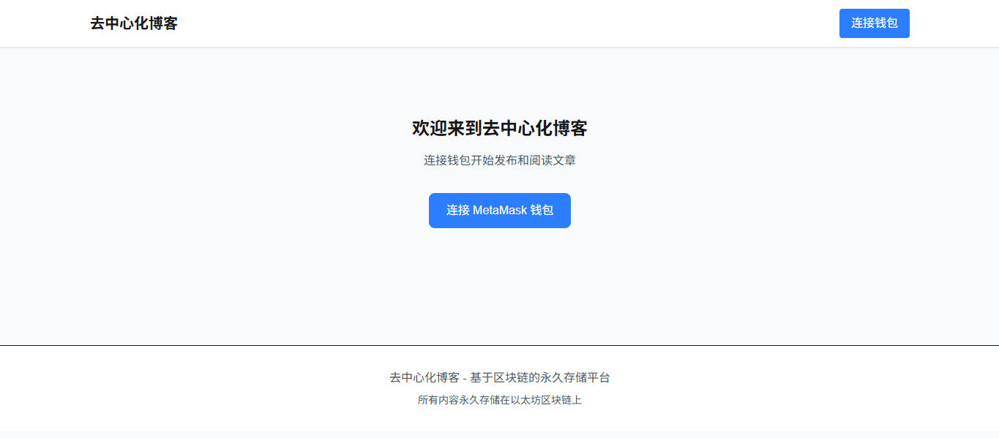
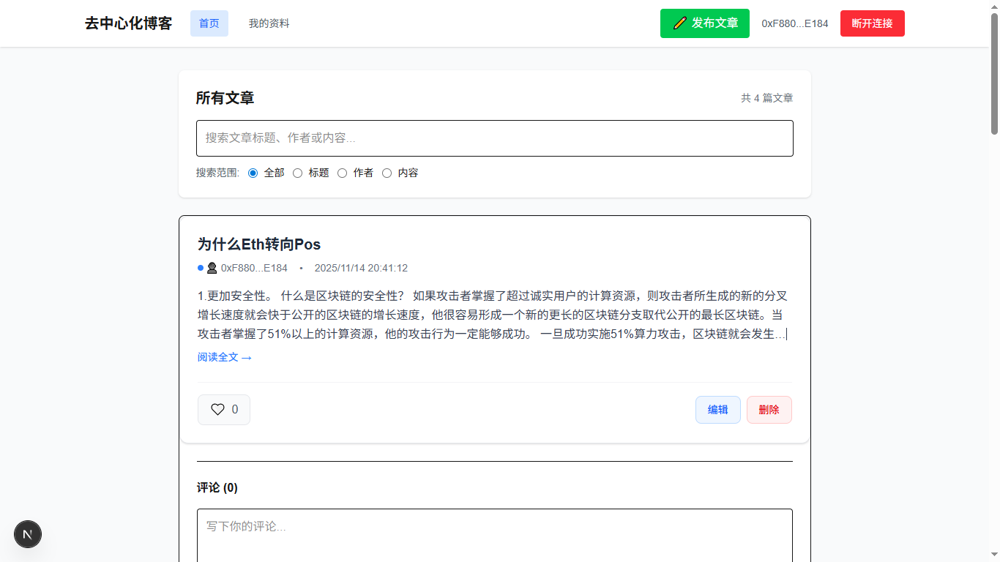
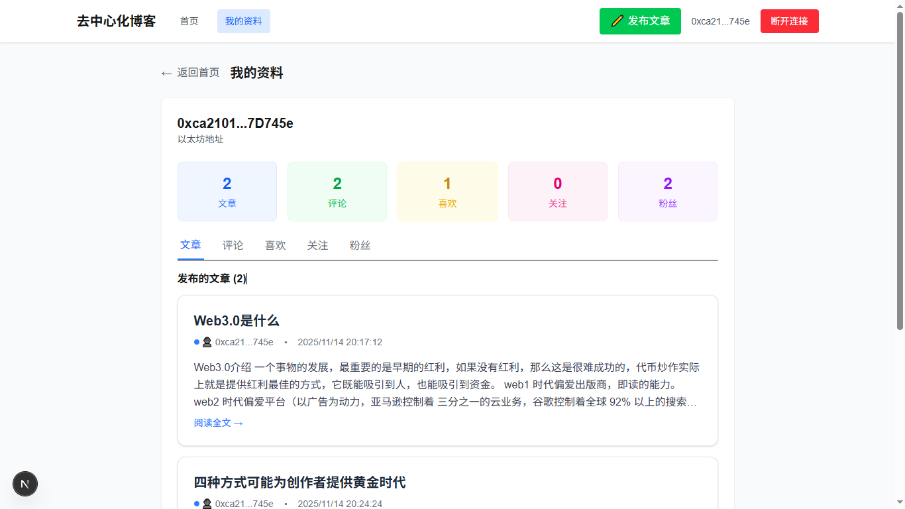
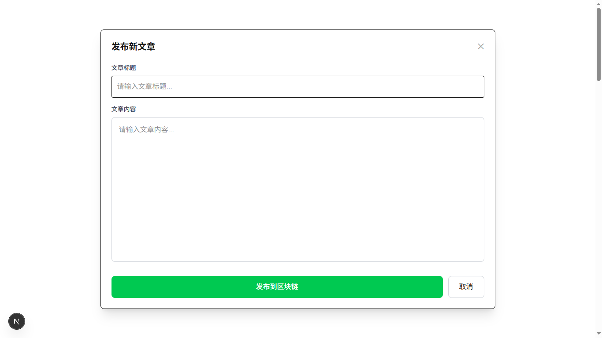
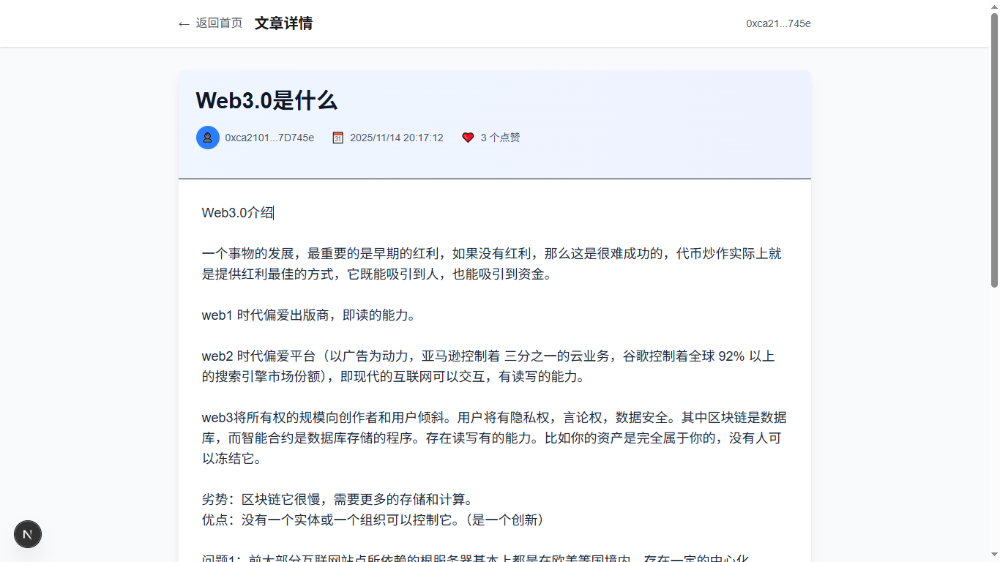
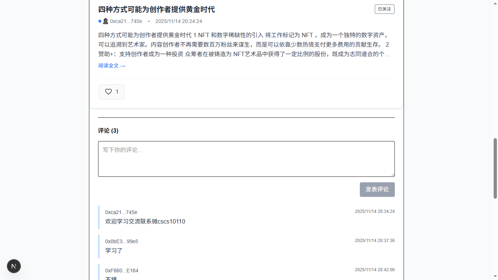

# 🚀 去中心化博客 (Decentralized Blog)
一个基于区块链技术的全栈去中心化博客平台，结合了现代 Web 开发框架和以太坊智能合约，为用户提供永久存储、去中心化内容发布和社交互动功能。
## 🌟 核心功能模块
#### 📝 文章管理系统
- 发布文章 - 标题和内容存储到 IPFS，元数据上链永久保存
- 编辑删除 - 作者可修改或软删除自己的文章，保留历史记录
- 文章列表 - 支持分页、搜索、排序和时间线展示
- 内容展示 - 从 IPFS 获取文章内容并安全渲染
#### 💬 社交互动系统
- 评论功能 - 每篇文章支持实时评论，链上存储确保真实性
- 点赞系统 - 用户可为文章点赞，防重复机制保证公平性
- 关注关系 - 用户间关注关系链上存储，透明可验证
- 粉丝管理 - 查看粉丝列表、关注状态和互动数据
#### 👤 用户身份系统
- 钱包登录 - MetaMask 连接和去中心化身份验证
- 个人资料 - 展示用户文章、评论、点赞和社交数据
- 内容管理 - 用户个人文章库和互动记录统计
- 数据看板 - 文章数、粉丝数、点赞数等数据可视化
## 🛠️ 技术架构
1. 前端技术栈
- Next.js 14 - React 全栈框架，支持 SSR/SSG
- Wagmi v2 + Viem - 现代以太坊交互库
- Tailwind CSS - 实用优先的 CSS 框架
- @tanstack/react-query - 服务器状态管理
2. 智能合约开发
- Hardhat - 以太坊开发框架和测试环境
- Ethers.js - 合约交互和部署库
- Solidity 0.8.28 - 智能合约编程语言
- OpenZeppelin - 经过审计的合约安全库
3. 存储方案
- 以太坊区块链 - 文章元数据、用户关系、社交互动
- IPFS (Pinata) - 文章内容分布式存储
- 事件日志 - 实时状态更新和历史记录 
## 🚀 快速开始
1. 克隆项目
```bash
git clone <项目地址>
cd decentralized-blog
```
2. 安装依赖
```bash
# 安装所有依赖
npm install
# 安装智能合约开发依赖
npm install --save-dev @openzeppelin/contracts
```
3. 环境配置
创建 .env 文件
```bash
# 设置网络环境。本地开发时不设置 NEXT_PUBLIC_NETWORK 或设置为其他值
# 测试网部署时：设置 NEXT_PUBLIC_NETWORK=sepolia设置 NEXT_PUBLIC_CONTRACT_ADDRESS=你的Sepolia合约地址
NEXT_PUBLIC_NETWORK=sepolia
NEXT_PUBLIC_SEPOLIA_RPC_URL=你的Infura_RPC_URL
DEPLOYER_PRIVATE_KEY=你的部署私钥
NEXT_PUBLIC_PINATA_JWT=你的Pinata_JWT
ETHERSCAN_API_KEY=你的Etherscan_API_KEY（可选）
```
4. 智能合约命令
```bash
# 编译合约
npx hardhat compile
# 运行测试
npx hardhat test
# 启动本地开发网络
# npx hardhat node
# 部署到本地网络
# npx hardhat run scripts/deploy.js --network localhost
# 部署到 Sepolia 测试网
npx hardhat run scripts/deploy.js --network sepolia
# 验证合约（部署后）
# npx hardhat verify --network sepolia <合约地址>
```
5. 前端开发命令
```bash
# 启动开发服务器
npm run dev
# 构建生产版本
npm run build
```
## 🌐  MetaMask钱包网络部署
本地开发环境
```bash
网络: Hardhat Local
链ID: 31337
RPC URL: http://localhost:8545
货币符号: ETH
区块浏览器: 无
```
Sepolia 测试网
```bash
网络: Sepolia Testnet
链ID: 11155111
RPC URL: 需要 Infura 或 Alchemy 端点
货币符号: ETH
区块浏览器: https://sepolia.etherscan.io
```
## 🌟 项目特色
🛡️ 真正的去中心化
- 内容永久存储在以太坊区块链和 IPFS
- 用户完全拥有自己的数据和身份
- 无中心化审查，自由表达观点

💡 技术创新
- 链上链下混合存储架构
- Gas 优化策略降低用户成本
- 实时事件监听和无刷新体验

🌐 现代技术栈
- 基于 Next.js 14 和 React 18
- 使用 Wagmi v2 + Viem 现代以太坊库
## 👥 目标用户
- 内容创作者 - 希望永久保存作品、避免平台审查的作家和博主
- Web3 爱好者 - 想要体验真正去中心化应用的早期用户
- 开发者 - 学习全栈 DApp 开发和技术架构的技术人员
- 自由表达者 - 重视言论自由和内容所有权的用户


## 图片实例
1. 钱包登录

2. 首页

3. 个人中心

4. 发布文章

5. 文章详情

6. 评论
